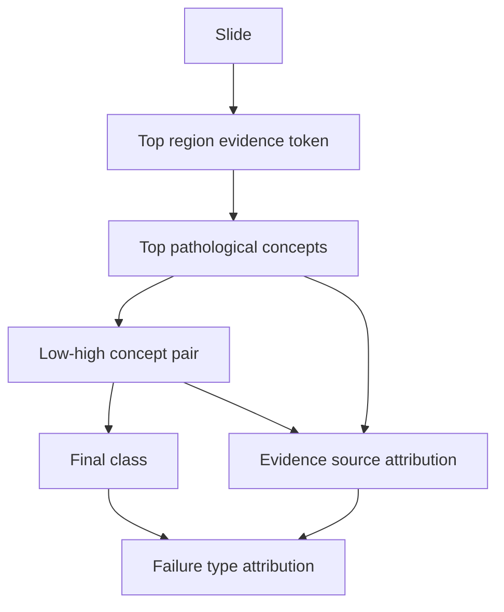

# Step40 Evidence Pipeline Mermaid

```mermaid
flowchart TD
    A[Slide] --> B[Top region evidence token]
    B --> C[Top pathological concepts]
    C --> D[Low-high concept pair]
    D --> E[Final class]
    E --> F[Failure type attribution]
    C --> G[Evidence source attribution]
    D --> G
    G --> F
```

说明：这条路径强调最终工作不是只输出类别，而是输出 evidence path、failure type 与 evidence source attribution。
