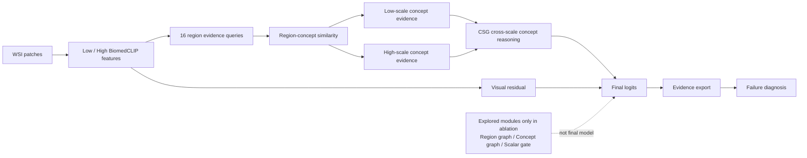

# Step40 Main Figure Mermaid

```mermaid
flowchart LR
    A[WSI patches] --> B[Low / High BiomedCLIP features]
    B --> C[16 region evidence queries]
    C --> D[Region-concept similarity]
    D --> E[Low-scale concept evidence]
    D --> F[High-scale concept evidence]
    E --> G[CSG cross-scale concept reasoning]
    F --> G
    B --> H[Visual residual]
    G --> I[Final logits]
    H --> I
    I --> J[Evidence export]
    J --> K[Failure diagnosis]
    L[Explored modules only in ablation\nRegion graph / Concept graph / Scalar gate] -.not final model.-> I
```

说明：region graph / concept graph / scalar gate 仅作为 explored modules / negative ablation 出现，不属于最终默认主模型主线。
