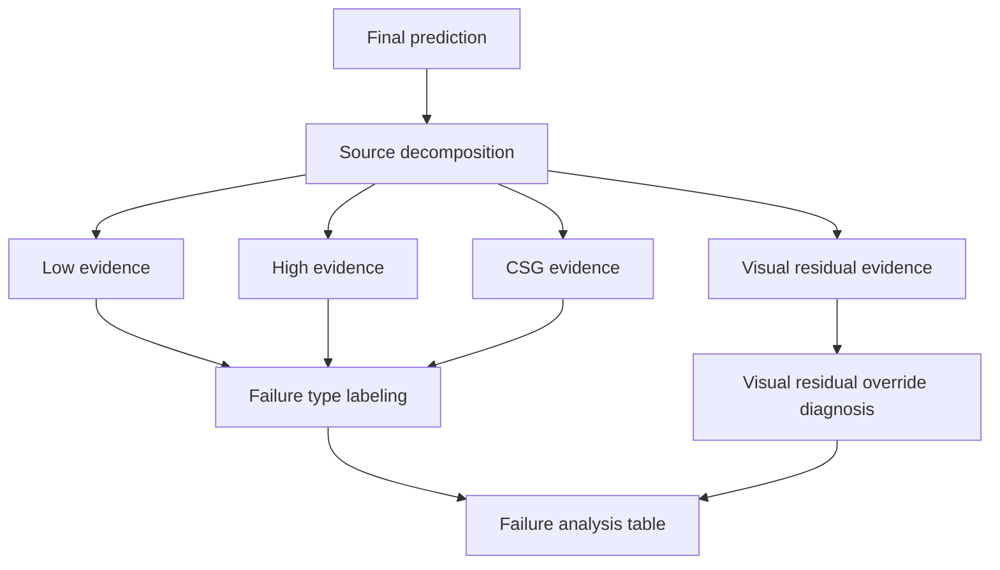

# Stage50 Evidence Pipeline Figure Mermaid

```mermaid
flowchart TD
    A[Final prediction] --> B[Source decomposition]
    B --> C[Low evidence]
    B --> D[High evidence]
    B --> E[CSG evidence]
    B --> F[Visual residual evidence]
    C --> G[Failure type labeling]
    D --> G
    E --> G
    F --> H[Visual residual override diagnosis]
    G --> I[Failure analysis table]
    H --> I
```

说明：该图用于论文中的 evidence/failure narrative，而不是训练图。
