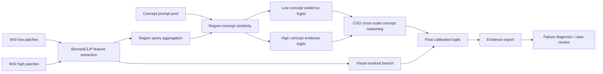

# Stage50 Main Method Figure Mermaid

```mermaid
flowchart LR
    A[WSI low patches] --> C[BiomedCLIP feature extraction]
    B[WSI high patches] --> C
    C --> D[Region query aggregation]
    P[Concept prompt pool] --> E[Region-concept similarity]
    D --> E
    E --> F[Low concept evidence logits]
    E --> G[High concept evidence logits]
    F --> H[CSG cross-scale concept reasoning]
    G --> H
    C --> I[Visual residual branch]
    H --> J[Final calibrated logits]
    I --> J
    J --> K[Evidence export]
    K --> L[Failure diagnosis / case review]
```

说明：HCRC/PRARC 不进入这张最终主方法图，只能在消融或 future work 图表中出现。
